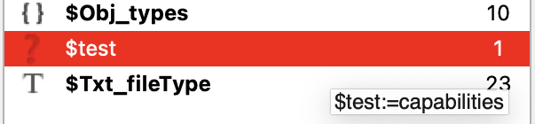
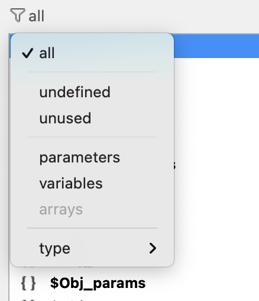
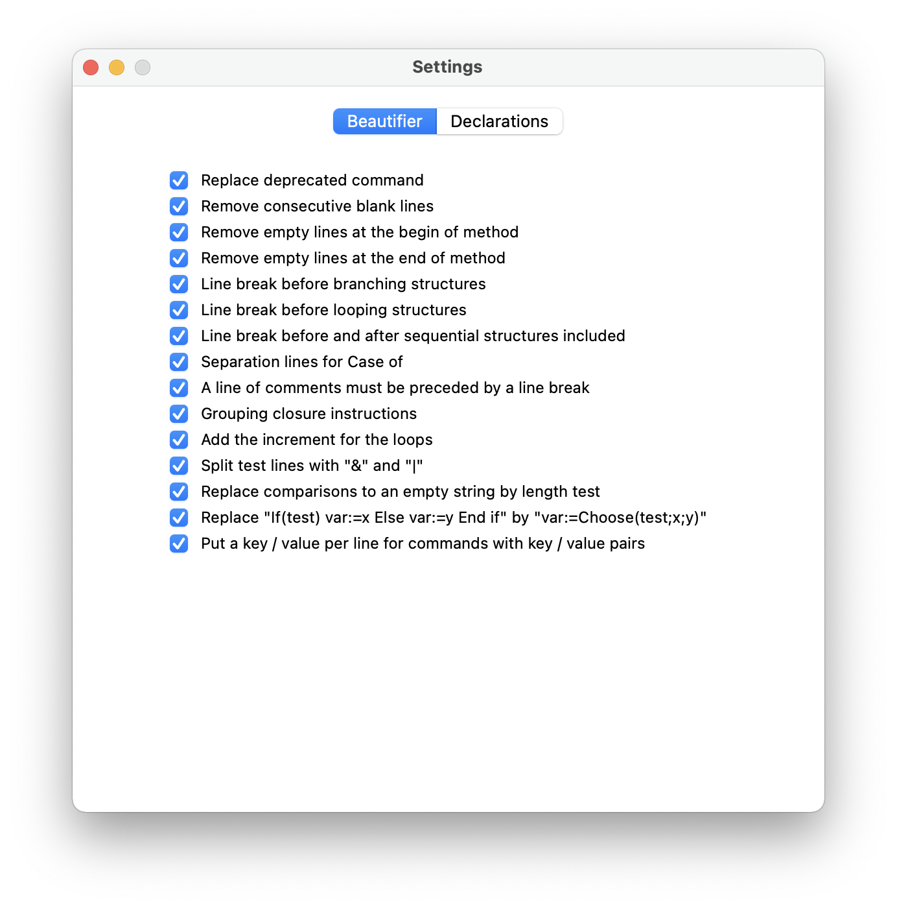

[](https://developer.4d.com/)
[](https://developer.4d.com/)

[](LICENSE)
[](https://github.com/vdelachaux/4DPop-Macros/releases/latest)


# <a name="overview">Overview</a>
`4DPop Macros` adds macros available to the method editor. Using macro-commands saves a lot of time during method entry.

When the component is loaded, the macros are automatically installed and available in the method editor, they can be invoked:

* By clicking on the [Macros](https://doc.4d.com/4Dv19/4D/19/Method-editor.300-5416861.en.html) button in the method editor toolbar.
* By double-clicking on their name in one of the footer lists of the method editor.
* For some of them (see the "[Menu](#menu)" column below) in the "Method" menu or the sub-menu of the "Insert macro" item of the editor's contextual menu.
* For some, by a keyboard shortcut indicated in the "[Shortcut](#shortcut)" column below.
* For some, in the predictive input window. The triggering text is indicated in the "[Input](#input)" column below.

For more information on the use and operation of macros, you can refer to the [Creating and using macros  ](https://doc.4d.com/4Dv19/4D/19/Creating-and-using-macros.300-5416864.en.html) of the 4D documentation.


# <a name="bestOf">Here are the macros I use every day</a>
That's why they have an associated shortcut 😉

| Name | Goal | <a name="menu">Menu</a> | <a name="input">Input</a> | <a name="shortcut">Shortcut</a>\* |
|------|------|:-------:|:----------:|:--------:|
| [Declarations…](#declaration) |Help with the declaration of parameters and local variables|✔︎||⌘ ⌥ c|
| [Compiler directive…](#compilerDirectives) |Help to enclose selection with [//%W](https://doc.4d.com/4Dv19/4D/19/Compiler-window.300-5416883.en.html) directive|✔︎||⌘ ⌥ ⇧ c|
| [Beautifier…](#beautifier) |A code formatter with|✔︎||⌘ §|
| [Copy and replace](#copyReplace) |Swaps the selection with the contents of the clipboard|✔︎||⌘ ⌥ c|
| [Special paste…](#specialPaste) |Pastes the text contained in the clipboard after transformations|✔︎|_p|⌘ ⌥ v|
| Duplicate and comment |The selected text is saved as a comment immediately before the selection. This allows you to preserve a piece of code before editing it.|✔︎||⌘ ⌥ d|
| Replay last macro |Replays the last macro used for the method being edited|✔︎||⌘ +|

\*Shortcuts may be displayed incorrectly in the macro menu because they are interpreted. e.g. `⌘ ⌥ c` will be displayed `⌘ ©`


## <a name="declaration">Declaration…</a>

This tool analyses the selection or the complete text\* of the method to extract the parameters and local variables, then tries to discover their type and displays the list of elements found, allowing you to change their type. Once validated, the declarations are placed at the top of the method or selection according to your choice. The declaration tool is able to parse the [C_xxx directives](https://doc.4d.com/4Dv19/4D/19/Compiler-Commands.300-5392141.en.html) and replace it using the [`var` keyword](https://developer.4d.com/docs/en/Concepts/variables.html#using-the-var-keyword).

\*Not yet for a class method, so it's best to work with the selection for now. 

<p align="center"></p>

* The list displays first the parameters, then the local variables.
* For each element, an icon represents the type deduced, and the number of uses in the analyzed code is displayed on the right.
* The elements for which the type could not be determined are displayed in red.
* A tooltip displays the line of code in which the first occurrence of the element was found.

<p align="center"></p>

* If a variable is not used the line is displayed in orange. It will not be included in the created directives.
* Arrays are underlined.
* To the right are the available types. The shortcut for each type is option+the underlined letter of the label
* The Filter menu allows you to display only certain items.

<p align="center"></p>

* If you close the window with the close box, the method is not changed.
* If you validate, the directives are pasted at the top of the method or selection, before the first line which is not a comment. Untyped or unused variables are ignored, declarations that have been made throughout the method, as well as all previous declarative blocks are deleted.

**Arrays**:
> 📍Since declaration and sizing use the same command, you can force the position of the command by using hexadecimal notation (or a variable) for the size, i.e.:
> ```4d
> ARRAY LONGINT($array; 0x0000)
> ARRAY TEXT($array; $size)
> ```
> 
> 📍Two-dimensional arrays are not yet supported

<br>
⚠️ In binary mode, the tool is different and is not more maintained. Please refer to the old documentation.

### 👀 How the tool determine the item type?

* If a variable or a parameter is already declared (with var, C_xxx or #DECLARE). It is obvious ;-)
* If no declaration line was found, the tools try to deduce the type by analyzing the code.
	* First by detecting simple patterns: for example, `$x:=10` gives the type **Integer** to $x, `$o.key:=10`gives the type **Object** to $o.
	* Then, using the 4D command syntax: `$x:=Count parameters` gives the type **Integer** to $x, `Is picture file ($pathname)` gives the type **Text** to $pathname.
	* And finally, if the type has still not been found using the nomenclature that you can define in the [preferences](#prefDeclaration).
* You can always force a type by selecting the one you want using the radio buttons on the right.

## <a name="compilerDirectives">Compiler directive…</a>

When the compiler [displays warnings](https://doc.4d.com/4Dv19/4D/19/Compiler-window.300-5416883.en.html) to draw your attention to instructions that could lead to runtime errors, you can, after analysis, selectively disable some of them during compilation.

To do this, select the line(s) of code in the method editor that cause this warning and call the macro. The tool asks for the number displayed in brackets (e.g. 538.3) and when you validate, surrounds the selected code with the pattern `//%W-538.3` ... `//%W+538.3`.

<p align="center">

## <a name="copyReplace">Copy and replace</a>
This macro is often useful even if the explanation of its operation seems complex. The usage scenario is as follows:

You type some code referring to a calculated expression and then you realize that you need this expression again later on and decide to put the expression in an intermediate variable. In this case you type `$maVariable:=MyExpression` and then replace `MyExpression` with `$maVariable`.

With the macro: 

* First type `$maVariable` and copy this text. 
* Then, select `MyExpression` and call the macro: The text "MyExpression" is placed in the clipboard and replaced by the text "$maVariable". 
*  Then, you position the cursor after the first occurence of `$myVariable` and type `:= `then paste the content of the clipboard to obtain `$myVariable:=MyExpression`.

## <a name="beautifier">Beautifier</a>

This tool formats the selected text, or the whole method if there is no selection, by applying the rules you have defined in the [preferences](#prefBeautifier).

## <a name="specialPaste">Special paste</a>

The tool displays a dialog allowing to choose what will be pasted in the method editor. The "Result" area allows you to preview the text as it will be pasted.

<p align="center">

The available transformations are :

1. **String**: The text is pasted between quotation marks, the special characters (\r, \n, \t and \") are escaped .
2. **Comments**: Each line is preceded by a comment mark, the text is not modified.
3. **HTML**: The html code contained in the clipboard is assigned to a local variable. The characters are escaped.
4. **Regex Pattern**: The text is pasted between quotation marks. The special characters of the pattern are escaped to be used as such taking into account that the backslash must be escaped in 4D.
5. **Pathname**: Pastes the path name of a file or folder copied to disk. You can choose the POSIX format instead of the system and choose to use a path relative to the project folder if relevant.
6. **Insert in text**: Allows you to insert an expression into a string by surrounding the clipboard content with `"+` and `+"`. The text thus created replaces the text selected in the string or is inserted at the cursor position.
7. **JSON code**: Transforms a JSON text into code to create a 4D object
8. **Tokenized**: Paste code with tokens

## <a name="redo">Replay last macro</a>

# <a name="others">Others available macros</a>

| Name | Goal | <a name="menu">Menu</a> | <a name="input">Input</a> | <a name="shortcut">Shortcut</a>\* |
|------|------|:-------:|:----------:|:--------:|
| [Macro test](#macroTest) | Call the project method `4DPop_TEST_Macros` of your database. Be sure to share the method.|✔︎||⌘ 0|
| Paste a color | Displays the system color palette and pastes the value of the selected color.|✔︎|_c||
| Find with Google |Launch a Google search, in the default browser, with the selected test|✔︎|||
| New method… | Creates a new method containing the selected text and replaces the selection with the method name.|✔︎|||
| Remove blank lines |As the name suggests|✔︎||⌘ \*|
| Comment block | Surround the selection with `/*` and `*/`|✔︎|||

## <a name="macroTest">Macro test</a>
🚧

## <a name="preferences">Preferences</a>
🚧
### <a name="prefDeclaration">Declaration preferences</a>


    


### <a name="prefBeautifier">Beautifier preferences</a>



